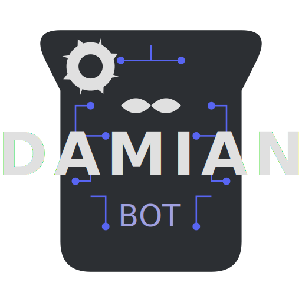

<div align="center">
  
</div>

# Damian Discord Bot

<div align="center">
  
  
  
  
  
</div>

A powerful and feature-rich Discord bot built with discord.js to enhance your server experience.

## Features

Damian offers a wide range of features to make your server more engaging and manageable.

### Moderation

* **Ban/Unban:** Ban and unban members from the server.
* **Kick:** Kick members from the server.
* **Warn:** Warn members for their behavior.
* **Clear:** Bulk delete messages from a channel.
* **Lock/Unlock:** Lock and unlock specific channels.
* **Timeout:** Mute members for a specified duration.
* **Move:** Move all members from one voice channel to another.
* **Role Management:** Add or remove roles from users.
* **Nickname Management:** Change the nickname of users.

### Fun & Entertainment

* **8ball:** Get answers to your questions from the Magic 8-Ball.
* **Anime:** Search for information about your favorite anime.
* **Comment:** Display your text as a YouTube comment.
* **Clyde:** Make Clyde say whatever you want.
* **Pokemon:** Get information about any Pokemon.
* **RPS:** Play Rock, Paper, Scissors with your friends.
* **Ship:** See how compatible two users are.
* **Sudo:** Make a webhook to impersonate someone.
* **Tic-Tac-Toe:** Play a game of Tic-Tac-Toe with your friends.
* **Trash:** Generate a "trash" meme with a user's avatar.
* **Wasted:** Generate a "wasted" meme from GTA with a user's avatar.
* **YouTube:** Watch YouTube together in a voice channel.

### Music

* **Play:** Play songs from YouTube, Spotify, and more.
* **Pause/Resume:** Pause and resume the current song.
* **Skip:** Skip the current song and play the next one in the queue.
* **Stop:** Stop the music and clear the queue.
* **Queue:** View the current song queue.
* **Now Playing:** See what song is currently playing.
* **Volume:** Adjust the volume of the music.
* **Repeat:** Loop the current song or the entire queue.
* **Autoplay:** Automatically play related songs when the queue is empty.
* **Jump:** Jump to a specific song in the queue.
* **Filter:** Apply audio filters to the music.
* **Previous:** Play the previous song in the queue.

### NSFW

* **Get NSFW images.**

### Miscellaneous

* **AFK:** Set your status to Away From Keyboard.
* **Avatar:** Get the avatar of a user.
* **Help:** Get a list of all available commands.
* **Invite:** Get the invite link for the bot.
* **Member Count:** See how many members are in the server.
* **Poll:** Create a poll for the server.
* **Server Info:** Get information about the server.
* **Spotify:** See what a user is listening to on Spotify.
* **Status:** Get the status of the bot.
* **Suggest:** Make a suggestion for the server.
* **User Info:** Get information about a user.
* **Vote:** Get the link to vote for the bot.

## Setup

To get started with Damian, follow these simple steps:

1.  **Clone the repository:**
    ```bash
    git clone [https://github.com/atushi17/damian.git](https://github.com/atushi17/damian.git)
    ```
2.  **Install dependencies:**
    ```bash
    npm install
    ```
3.  **Configure the bot:**
    * Rename `config.json.example` to `config.json`.
    * Fill in the required information in `config.json`, such as your bot token and database connection string.
4.  **Start the bot:**
    ```bash
    npm start
    ```

## Contributing

Contributions are welcome! If you have any ideas, suggestions, or bug reports, please open an issue or create a pull request.
